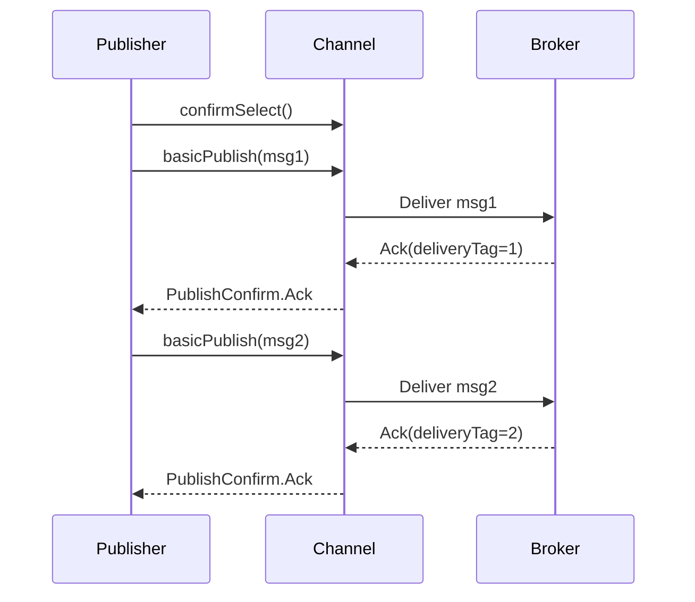

# Publisher Confirms

In previous tutorials we have covered various messaging patterns. However, we haven't discussed how to ensure that
messages are reliably delivered to the broker. Publisher confirms are a RabbitMQ extension to implement reliable
publishing. When publisher confirms are enabled on a channel, messages published by the client are confirmed
asynchronously by the broker, meaning they have been taken care of on the server side.



## Enabling publisher confirms on a channel

To enable publisher confirms on a channel, use the `confirmSelect` method:

```kotlin
channel.confirmSelect()
```

Once confirms are enabled on a channel, each published message receives a confirmation (ack or nack) from the broker.

## Confirm responses

Kourier provides confirms through a Flow:

```kotlin
channel.publishConfirmResponses.collect { confirm ->
    when (confirm) {
        is AMQPResponse.Channel.Basic.PublishConfirm.Ack -> {
            // Message accepted
            println("Confirmed: ${confirm.deliveryTag}")
        }
        is AMQPResponse.Channel.Basic.PublishConfirm.Nack -> {
            // Message rejected
            println("Rejected: ${confirm.deliveryTag}")
        }
    }
}
```

Each published message is assigned a delivery tag (sequence number). Confirms reference this tag to identify which
message was confirmed. The `multiple` property indicates whether the confirm applies to only the specific delivery tag
(`false`) or all messages up to and including the delivery tag (`true`).

### ⚠️ Subscribe *before* publishing

`publishConfirmResponses` is a `SharedFlow` with `replay=0`: emissions made **before** a subscriber attaches
are silently dropped. The broker can ack a publish in microseconds, so the following pattern is racy:

```kotlin
channel.basicPublish(...)                                  // ① publish
val confirm = channel.publishConfirmResponses.first()      // ② subscribe (too late)
// On a fast/loopback broker, ② can subscribe AFTER the Ack
// is emitted in step ①'s wake — `.first()` hangs forever.
```

Always wire the subscriber **before** the operation that triggers the emission. With `async`/`launch`, use
`CoroutineStart.UNDISPATCHED` so the body runs synchronously up to the first suspension point (the SharedFlow
subscribe) before `async`/`launch` returns:

```kotlin
// Correct: subscribe before publish — `await()` is guaranteed to see the Ack.
val confirmDeferred = async(start = CoroutineStart.UNDISPATCHED) {
    channel.publishConfirmResponses.first()
}
channel.basicPublish(...)
val confirm = confirmDeferred.await()
```

The same applies to long-running collectors:

```kotlin
val confirmJob = launch(start = CoroutineStart.UNDISPATCHED) {
    channel.publishConfirmResponses.collect { confirm -> /* ... */ }
}
// ...now safe to publish: the collector is attached.
repeat(messageCount) { channel.basicPublish(...) }
```

This applies to **every** SharedFlow exposed by kourier (`publishConfirmResponses`, `returnResponses`,
`closedResponses`, `openedResponses`, `flowResponses`). All code examples below already follow this pattern.

## Strategy 1: Publishing messages individually

The simplest approach: publish a message and wait for its confirm before publishing the next.

```kotlin
suspend fun publishWithIndividualConfirms(channel: AMQPChannel, messages: List<String>) = coroutineScope {
    // Enable publisher confirms
    channel.confirmSelect()

    for (message in messages) {
        // Subscribe BEFORE publishing — see "Subscribe before publishing" above.
        val confirmDeferred = async(start = CoroutineStart.UNDISPATCHED) {
            channel.publishConfirmResponses.first()
        }

        // Publish message
        channel.basicPublish(
            message.toByteArray(),
            exchange = "",
            routingKey = "my_queue",
            properties = Properties()
        )

        // Wait for confirm
        when (val confirm = confirmDeferred.await()) {
            is AMQPResponse.Channel.Basic.PublishConfirm.Ack -> {
                println("✓ Message confirmed: $message")
            }
            is AMQPResponse.Channel.Basic.PublishConfirm.Nack -> {
                println("✗ Message rejected: $message")
                // Handle rejection (retry, log, etc.)
            }
        }
    }
}
```

**Pros:**

- Simple and straightforward
- Easy error handling
- Know immediately if a message failed

**Cons:**

- Very slow (hundreds of messages/second)
- Blocks on each message
- Not suitable for high throughput

## Strategy 2: Publishing messages in batches

Publish multiple messages, then wait for all confirms.

```kotlin
suspend fun publishWithBatchConfirms(channel: AMQPChannel, messages: List<String>, batchSize: Int) = coroutineScope {
    channel.confirmSelect()

    messages.chunked(batchSize).forEach { batch ->
        // Subscribe BEFORE publishing the batch — see "Subscribe before publishing" above.
        // The broker may bulk-confirm with Ack(multiple=true) so we wait on the highest
        // deliveryTag covered rather than counting emissions (one Ack(multiple=true) can
        // cover many tags).
        val confirms = mutableListOf<AMQPResponse.Channel.Basic.PublishConfirm>()
        val confirmJob = launch(start = CoroutineStart.UNDISPATCHED) {
            channel.publishConfirmResponses.collect { confirms += it }
        }

        // Publish entire batch — capture the last deliveryTag so we know when we're done.
        var lastTag = 0uL
        batch.forEach { message ->
            val published = channel.basicPublish(
                message.toByteArray(),
                exchange = "",
                routingKey = "my_queue",
                properties = Properties()
            )
            lastTag = published.deliveryTag
        }

        // Wait until the highest confirmed tag covers our last publish.
        while (confirms.maxOfOrNull { it.deliveryTag } != lastTag && confirms.none { it.deliveryTag >= lastTag }) {
            yield()
        }
        confirmJob.cancelAndJoin()

        val ackCount = confirms.count { it is AMQPResponse.Channel.Basic.PublishConfirm.Ack }
        val nackCount = confirms.count { it is AMQPResponse.Channel.Basic.PublishConfirm.Nack }

        println("Batch complete: $ackCount acks, $nackCount nacks")

        if (nackCount > 0) {
            // Handle failures (can't identify specific messages easily)
            println("Warning: Some messages in batch were rejected")
        }
    }
}
```

**Pros:**

- Much faster than individual (20-30x improvement)
- Still relatively simple
- Good balance of throughput and simplicity

**Cons:**

- Hard to identify which specific message failed
- If one fails, must retry entire batch
- Still blocks between batches

## Strategy 3: Handling publisher confirms asynchronously

Handle confirms asynchronously while continuing to publish.

```kotlin
suspend fun publishWithAsyncConfirms(channel: AMQPChannel, messages: List<String>) = coroutineScope {
    channel.confirmSelect()

    val outstandingConfirms = mutableMapOf<ULong, String>()
    var nextDeliveryTag = 1UL

    // Launch coroutine to handle confirms — UNDISPATCHED so the SharedFlow subscriber
    // is wired BEFORE we start publishing. Without this, fast brokers can ack the first
    // few messages before the collector attaches and those acks are silently dropped
    // (see "Subscribe before publishing" above).
    val confirmJob = launch(start = CoroutineStart.UNDISPATCHED) {
        channel.publishConfirmResponses.collect { confirm ->
            when (confirm) {
                is AMQPResponse.Channel.Basic.PublishConfirm.Ack -> {
                    if (confirm.multiple) {
                        // Remove all up to and including this tag
                        outstandingConfirms.keys.filter { it <= confirm.deliveryTag }
                            .forEach { outstandingConfirms.remove(it) }
                    } else {
                        outstandingConfirms.remove(confirm.deliveryTag)
                    }
                }
                is AMQPResponse.Channel.Basic.PublishConfirm.Nack -> {
                    val message = outstandingConfirms[confirm.deliveryTag]
                    println("✗ Message nacked: $message")
                    // Handle specific message rejection
                    outstandingConfirms.remove(confirm.deliveryTag)
                }
            }
        }
    }

    // Publish all messages
    messages.forEach { message ->
        outstandingConfirms[nextDeliveryTag] = message

        channel.basicPublish(
            message.toByteArray(),
            exchange = "",
            routingKey = "my_queue",
            properties = Properties()
        )

        nextDeliveryTag++
    }

    // Wait until all confirms are received
    while (outstandingConfirms.isNotEmpty()) {
        delay(10)
    }

    confirmJob.cancel()
}
```

**Pros:**

- Best performance (only slightly slower than batch)
- Can identify specific failed messages
- Non-blocking publishing
- Production-ready

**Cons:**

- Most complex implementation
- Requires tracking outstanding messages
- Need to handle bulk confirms (`multiple` flag)

## Summary

We have covered three approaches to publisher confirms:

1. Publishing messages individually: simple, synchronous, slow
2. Publishing messages in batches: improved throughput, still synchronous
3. Handling publisher confirms asynchronously: best performance, most complex

## Putting it all together

```kotlin
import dev.kourier.amqp.AMQPResponse
import dev.kourier.amqp.Properties
import dev.kourier.amqp.connection.amqpConfig
import dev.kourier.amqp.connection.createAMQPConnection
import kotlinx.coroutines.*
import kotlinx.coroutines.flow.first

fun main() = runBlocking {
    val config = amqpConfig {
        server {
            host = "localhost"
        }
    }
    val connection = createAMQPConnection(this, config)
    val channel = connection.openChannel()

    // Declare queue
    channel.queueDeclare("confirms_queue", false, false, true, emptyMap())

    // Enable confirms
    channel.confirmSelect()

    // Publish with async confirms
    val messages = List(1000) { "Message $it" }

    val startTime = System.currentTimeMillis()
    publishWithAsyncConfirms(channel, messages)
    val duration = System.currentTimeMillis() - startTime

    println("Published ${messages.size} messages in ${duration}ms")

    channel.close()
    connection.close()
}
```
